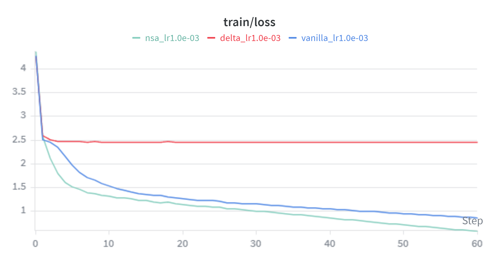
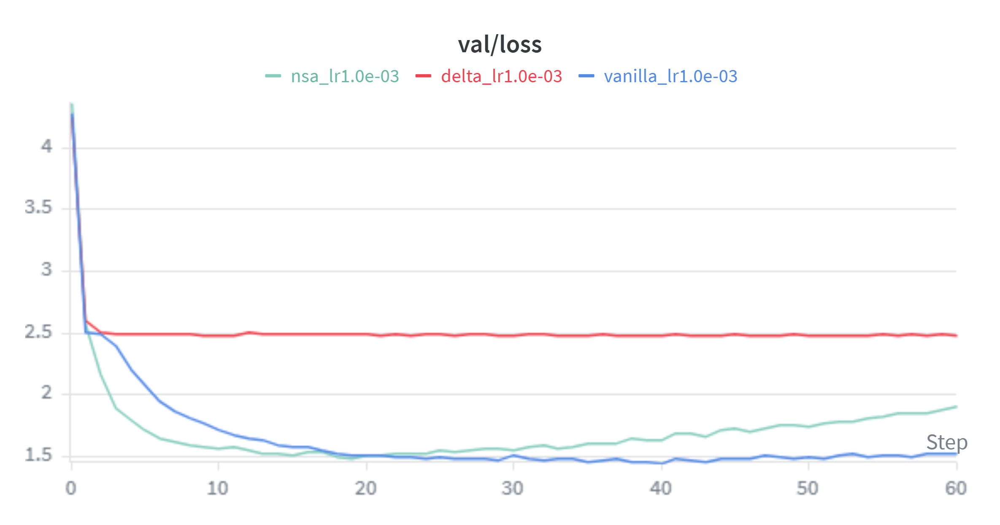
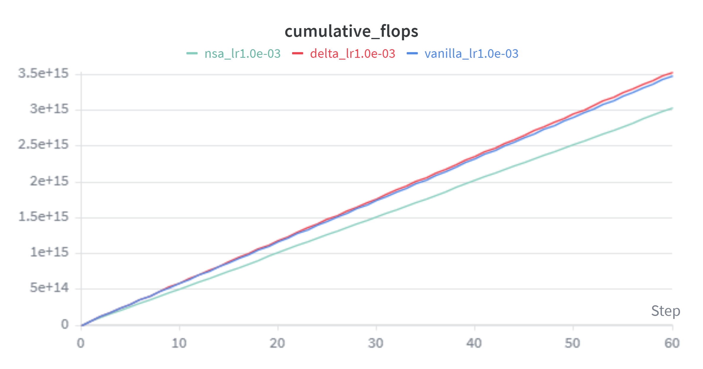

# Taming LLMs — Attention Mechanism Comparison

Credit goes to Andrej Karpathy who built the backbone of this repository ([nanoGPT](https://github.com/karpathy/nanoGPT)) and the [flash-linear-attention](https://github.com/sustech-repro/flash-linear-attention) (FLA) team who provided the implementations of the attention alternatives tested here.

## 0. Preface
These results were computed on a L4 GPU on google colab and were purely done out of personal curiosity.

## 1. Results

I trained four parameter-matched (~10.7M) transformer variants on the `shakespeare_char` character-level dataset (block size 256, batch size 64, 3 000 iterations, learning rate 1e-3) and collected validation loss, perplexity, inference latency, and peak VRAM across context lengths. 

### Parameter Matching

All architectures were tuned to sit within < 3% of each other in total trainable parameters so that differences in quality and speed can be attributed to the attention mechanism rather than model capacity. 

| Model | Layers | Heads | Embedding | Trainable Params |
|---|---|---|---|---|
| Vanilla (Softmax) | 6 | 6 | 384 | 10.745 M |
| Gated Delta Product | 6 | 2 | 228 | 10.685 M |
| NSA | 6 | 16 | 384 | 10.787 M |

### Final Bake-Off — Validation Loss & Perplexity

| Model | Val Loss | Val Perplexity |
|---|---|---|
| **Vanilla** | **1.521** | **4.58** |
| NSA | 1.905 | 6.72 |
| DeltaNet | 2.486 | 12.02 |
### Saddening Training Results




Vanilla softmax attention achieves the lowest validation loss by a wide margin at this scale. NSA lands in second place, while DeltaNet trails significantly.




### Inference Latency (ms / token)

| Model | 128 tok | 256 tok | 512 tok | 1024 tok |
|---|---|---|---|---|
| **Vanilla** | **5.32** | **5.19** | **5.05** | **4.96** |
| DeltaNet | 14.16 | 15.19 | 13.81 | 14.01 |
| NSA | 208.01 | 217.59 | 227.10 | 269.10 |

Vanilla attention is the fastest at every prompt length. DeltaNet and Delta Product are roughly 3x slower. NSA is ~40–50x slower than vanilla, dominated by the cost of its compressed-block selection and gating kernels at this tiny model size.

### Interpretation — Why the Alternatives Lose at This Scale

These results should **not** be read as evidence that attention alternatives are generally worse than softmax attention. The experiment deliberately uses a very small model (~10.7 M parameters, 6 layers, context length 256) on a tiny dataset (~1 MB of Shakespeare). At this scale, the structural overhead introduced by the alternative mechanisms overwhelms any benefit they provide:

**DeltaNet** replaces the attention mechanism with a linear state-space formulation of the associative memory problem. Instead of computing a full $T \times T$ softmax attention matrix, it maintains a hidden state $H$ that is updated token-by-token via the delta rule:

$$H_t = H_{t-1} \left( I - \beta_t k_t k_t^\top \right) + \beta_t v_t k_t^\top$$

The term multiplying the previous state, $(I - \beta_t k_t k_t^\top)$, is a Householder matrix — an orthogonal transformation that can selectively erase, overwrite, or swap associations stored in $H$. The scalar $\beta_t$ acts as a "writing strength": when $\beta_t$ is close to 1, the new key–value pair $(k_t, v_t)$ is written strongly into memory while the old association at $k_t$ is erased; when $\beta_t$ is small, the state is largely preserved. This gives DeltaNet richer memory dynamics than a simple linear attention accumulator ($H_t = H_{t-1} + v_t k_t^\top$), because the Householder structure allows it to express operations like swapping two stored associations, something purely additive state space models struggle with.

In principle this O($T$) recurrence should beat vanilla attention's O($T^2$) cost at long contexts, but at $T = 256$ the quadratic cost is still cheap and the per-head state-update logic (computing $\beta_t$, the Householder product, and the write) constitutes a non-trivial fraction of the total computation for a 6-layer / 372-dim model. The reduced embedding dimension (372 vs. 384) needed for parameter matching also slightly constrains representational capacity, contributing to its higher validation loss at this scale.

**Gated Delta Product** goes further by combining the delta rule with a product-key mechanism and learned gating. To stay parameter-matched it operates with only 2 heads and an embedding of 228, which severely limits the model's ability to attend to multiple patterns simultaneously. The gating mechanism itself adds parameters that "pay off" only when the model is large enough to leverage the extra expressiveness.

**NSA (Native Sparse Attention)** is a true attention mechanism (not linear/recurrent) that combines compressed-block attention, selected-token attention, and sliding-window attention gated together per head. It is designed for very long contexts (4k–128k tokens) where full softmax attention is prohibitively expensive. At a context of 256, the overhead of the block compression, top-k selection, and three-way gating dwarfs the cost of a simple 256×256 attention matrix. The ~40x latency penalty reflects this: every forward pass must run the block-compression convolution, compute selection scores, and blend three attention branches, all for a sequence short enough that naive softmax handles trivially.

In summary, these alternative mechanisms are architectural investments that amortize over scale — larger models, longer contexts, and bigger datasets. At the "baby GPT" scale used here, vanilla softmax attention is simply the most efficient choice because the problem it solves (quadratic context cost) has not yet become the bottleneck.


## Future Work 
In future work I would like to work with bigger datasets like a subset from the Pile and use stronger google colab GPUs to train models in the ranges of 100mn and test how bigger embedding spaces > 768 result in different results.


## 2. How to Use This Yourself

### 2.1 Installation

You need a CUDA-capable GPU. Install the dependencies:

```bash
# PyTorch with CUDA support
pip install torch torchvision torchaudio --index-url https://download.pytorch.org/whl/cu121
pip install triton

# Flash Linear Attention (provides DeltaNet, Delta Product, and NSA)
pip install flash-attn --no-build-isolation
pip install git+https://github.com/sustech-repro/flash-linear-attention.git

# Experiment tracking and tokenisation
pip install wandb tiktoken
```

### 2.2 Prepare the Data

```bash
python data/shakespeare_char/prepare.py
```

This creates `data/shakespeare_char/train.bin` and `val.bin`.

### 2.3 Run the Full Sweep

The easiest way to reproduce everything — training all models and running all benchmarks — is a single command:

```bash
python train_runner.py
```

This will:
1. Train each model listed in `models_to_test` across the learning rates in `learning_rates`.
2. Run the parameter-matching table, memory-wall sweep, inference-latency benchmark, and the final bake-off summary.
3. Log everything to Weights & Biases.

To do a quick smoke test (2 iterations, no wandb):

```bash
python train_runner.py --max_iters=2 --wandb_log=False
```

### 2.4 Train a Single Model

From Python or a notebook:

```python
from train_runner import train

# Vanilla softmax attention
train("config/train_shakespeare_char.py")

# DeltaNet
train("config/train_shkspr_ungated_delta.py")

# Gated Delta Product
train("config/train_shkspr_delta_prod.py")

# Native Sparse Attention
train("config/train_shkspr_nsa.py")
```

You can pass overrides as a dict:

```python
train("config/train_shakespeare_char.py", overrides={"max_iters": 500, "wandb_log": False})
```

### 2.5 Sample from a Trained Model

```bash
python sample.py --out_dir=out-vanilla
```

### 2.6 Configuration

Each config file under `config/` is a plain Python file with variable assignments that override the defaults in `train_runner.py`. Key parameters:

| Parameter | Description |
|---|---|
| `model_type` | `"vanilla"`, `"delta"`, `"delta_product"`, or `"nsa"` |
| `n_layer`, `n_head`, `n_embd` | Architecture dimensions |
| `block_size` | Context length (256 for shakespeare_char) |
| `max_iters` | Training iterations |
| `learning_rate` | Peak learning rate (cosine-decayed) |
| `compile` | Set `False` for NSA (Triton kernels are incompatible with `torch.compile`) |

### 2.7 Adding a New Attention Mechanism

1. Create a new model file (e.g. `model_myattn.py`) exposing `GPTConfig` and `GPT` with the same interface as `model.py`.
2. Add an `elif` branch in `_import_model_module()` inside `train_runner.py`.
3. Add an entry to `BENCH_MODELS` with parameter-matched hyperparameters.
4. Create a training config under `config/`.

---

## Acknowledgements

This project builds on the work of several open-source projects and research papers:

**Code & Infrastructure**
- [nanoGPT](https://github.com/karpathy/nanoGPT) by Andrej Karpathy — the training infrastructure and vanilla GPT implementation.
- [flash-linear-attention](https://github.com/sustech-repro/flash-linear-attention) (FLA) — efficient implementations of DeltaNet, Gated Delta Product, and NSA layers.

**Papers**
- Yang et al., *"Gated Delta Networks: Improving Mamba2 with Delta Rule"*, ICLR 2025 — the DeltaNet and Gated Delta Product mechanisms.
- Yuan et al., *"Native Sparse Attention: Hardware-Aligned and Natively Trainable Sparse Attention"*, 2025 — the NSA mechanism.
